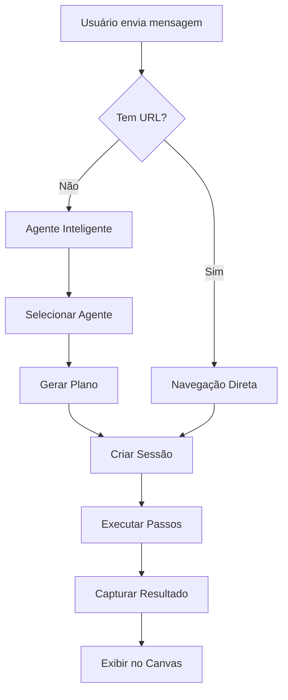

# 🤖 Sistema de Agentes de Navegação Inteligente

## 📋 Visão Geral

Sistema completo de agentes inteligentes que usam modelos Gemini para planejar e executar navegações web automatizadas através do Playwright.

## 🎯 Funcionalidades

### ✅ Implementado

1. **Múltiplos Agentes Gemini**
   - Gemini 2.5 Flash (1500 req/dia)
   - Gemini 2.5 Flash Lite (1500 req/dia)
   - Gemini 2.0 Flash (1000 req/dia - reserva)

2. **Balanceamento Automático**
   - Intercalação entre modelos
   - Controle de quota por dia e por minuto
   - Fallback automático

3. **Planejamento Inteligente**
   - IA analisa intenção do usuário
   - Gera plano de ação em JSON
   - Passos detalhados e específicos

4. **Execução Automatizada**
   - Navegação (navigate)
   - Espera (wait)
   - Clique (click)
   - Preenchimento (fill)
   - Extração (extract)
   - Screenshot (screenshot)

5. **Feedback em Tempo Real**
   - Progresso visual no chat
   - Barra de progresso
   - Mensagens de status

6. **Integração com Canvas**
   - Visualização de screenshots
   - Conteúdo extraído
   - Plano de execução

## 🏗️ Arquitetura

```
Frontend (React/TypeScript)
├── navigatorAgentService.ts      # Cliente dos agentes
├── App.tsx                        # Integração no chat
└── ChatView.tsx                   # Interface

Backend (Node.js/Express)
├── navigatorAgentService.js      # Gerenciador de agentes
├── browserService.js             # Playwright wrapper
└── server.js                     # Rotas da API

Modelos Gemini
├── gemini-2.5-flash              # Agente principal
├── gemini-2.5-flash-lite         # Agente secundário
└── gemini-2.0-flash              # Agente reserva
```

## 🚀 Como Usar

### 1. Ativar Modo Navegação

No chat, clique no botão **"Modo Navegação"** ou use o atalho.

### 2. Comandos Naturais

Você pode usar linguagem natural para navegar:

```
✅ "Entre no site do GitHub e busque por playwright"
✅ "Navegue para amazon.com e procure por notebooks"
✅ "Acesse o Google e pesquise por inteligência artificial"
✅ "Vá para wikipedia.org e busque sobre Python"
✅ "Abra o site do Mercado Livre e tire um screenshot"
```

### 3. URLs Diretas

Ou fornecer URLs diretamente:

```
✅ "playwright.dev"
✅ "https://github.com"
✅ "example.com"
```

## 📊 Fluxo de Execução



## 🔧 Endpoints da API

### POST /api/navigator/process
Processar intenção completa (planejar + executar)

```json
{
  "userIntent": "Entre no GitHub e busque por playwright",
  "context": {}
}
```

### POST /api/navigator/plan
Apenas gerar plano de navegação

```json
{
  "userIntent": "Busque por notebooks na Amazon",
  "context": {}
}
```

### POST /api/navigator/execute
Executar plano existente

```json
{
  "plan": { ... },
  "sessionId": "session_123"
}
```

### GET /api/navigator/stats
Obter estatísticas dos agentes

```json
{
  "agents": [
    {
      "name": "Gemini 2.5 Flash",
      "callsToday": 45,
      "quotaPerDay": 1500,
      "available": true
    }
  ],
  "metrics": {
    "totalCalls": 120,
    "successfulCalls": 115,
    "plansGenerated": 60,
    "plansExecuted": 58
  }
}
```

## 📝 Formato do Plano

Os agentes geram planos em JSON:

```json
{
  "objective": "Buscar por notebooks na Amazon",
  "url": "https://www.amazon.com",
  "steps": [
    {
      "action": "navigate",
      "value": "https://www.amazon.com",
      "timeout": 30000,
      "description": "Navegar para Amazon"
    },
    {
      "action": "wait",
      "selector": "#twotabsearchtextbox",
      "timeout": 10000,
      "description": "Aguardar campo de busca"
    },
    {
      "action": "fill",
      "selector": "#twotabsearchtextbox",
      "value": "notebooks",
      "description": "Preencher campo de busca"
    },
    {
      "action": "click",
      "selector": "#nav-search-submit-button",
      "description": "Clicar em buscar"
    },
    {
      "action": "screenshot",
      "description": "Capturar resultado"
    }
  ],
  "expectedResult": "Lista de notebooks na Amazon"
}
```

## 🎨 Interface do Usuário

### Feedback Visual

```
🤖 Agente de Navegação Ativado

🧠 Analisando sua solicitação...
✅ Plano criado por Gemini 2.5 Flash (5 passos)
✅ Sessão iniciada
📍 Passo 1/5: Navegar para Amazon
▓▓▓▓▓▓▓▓░░░░░░░░░░░░ 40%
```

### Canvas

- Screenshot da página
- Título e URL
- Conteúdo extraído
- Plano executado

## 🔒 Controle de Quotas

### Por Dia
- Flash: 1500 requisições
- Lite: 1500 requisições
- Pro: 1000 requisições
- **Total: 4000 req/dia**

### Por Minuto
- Flash: 15 requisições
- Lite: 15 requisições
- Pro: 10 requisições

### Balanceamento
1. Tenta usar Flash (prioridade 1)
2. Se Flash esgotado, usa Lite (prioridade 2)
3. Se ambos esgotados, usa Pro (prioridade 3)
4. Se todos esgotados, aguarda 1 minuto

## 🧪 Exemplos de Uso

### Exemplo 1: Pesquisa Simples
```
Usuário: "Busque por Python no Google"

Plano:
1. Navegar para google.com
2. Aguardar campo de busca
3. Preencher "Python"
4. Clicar em buscar
5. Capturar screenshot

Resultado: Screenshot dos resultados + conteúdo extraído
```

### Exemplo 2: Login (Futuro)
```
Usuário: "Faça login no GitHub com demo/demo123"

Plano:
1. Navegar para github.com/login
2. Aguardar formulário
3. Preencher username: demo
4. Preencher password: demo123
5. Clicar em Sign in
6. Aguardar dashboard
7. Capturar screenshot

Resultado: Screenshot do dashboard logado
```

### Exemplo 3: Extração de Dados
```
Usuário: "Extraia os preços de notebooks na Amazon"

Plano:
1. Navegar para amazon.com
2. Buscar por "notebooks"
3. Aguardar resultados
4. Extrair conteúdo (preços, títulos)
5. Capturar screenshot

Resultado: Lista estruturada de produtos + screenshot
```

## 📈 Métricas

O sistema rastreia:

- Total de chamadas
- Chamadas bem-sucedidas
- Chamadas falhadas
- Tempo médio de resposta
- Planos gerados
- Planos executados
- Uso por agente

## 🔮 Próximos Passos

### Curto Prazo
- [ ] Suporte a formulários complexos
- [ ] Autenticação em sites
- [ ] Extração estruturada de dados
- [ ] Cache de planos comuns

### Médio Prazo
- [ ] Agentes especializados (e-commerce, redes sociais, etc)
- [ ] Aprendizado com execuções anteriores
- [ ] Validação de resultados
- [ ] Retry automático em falhas

### Longo Prazo
- [ ] Agentes colaborativos (múltiplos agentes trabalhando juntos)
- [ ] Planejamento multi-página
- [ ] Automação de workflows completos
- [ ] Integração com RPA

## 🛠️ Configuração

### Variáveis de Ambiente

```env
GEMINI_API_KEY=sua_chave_aqui
VITE_GEMINI_API_KEY=sua_chave_aqui
```

### Modelos Disponíveis

Os nomes corretos dos modelos são:
- `gemini-2.5-flash`
- `gemini-2.5-flash-lite`
- `gemini-2.0-flash`
- `gemini-2.0-flash-lite`

## 🐛 Troubleshooting

### Erro: "Agentes não disponíveis"
- Verifique se GEMINI_API_KEY está configurada
- Reinicie o backend

### Erro: "Todos os agentes atingiram o limite"
- Aguarde 1 minuto para reset da quota por minuto
- Ou aguarde até o próximo dia para reset diário

### Erro: "Plano não executado"
- Verifique se o Playwright está instalado
- Verifique logs do backend para detalhes

## 📚 Referências

- [Playwright Documentation](https://playwright.dev)
- [Gemini API Documentation](https://ai.google.dev/docs)
- [Navegador Integrado](./NAVEGADOR_INTEGRADO.md)
- [Sistema Completo](./SISTEMA_COMPLETO_FINAL.md)

---

**Status**: ✅ Implementado e Funcional
**Versão**: 1.0.0
**Data**: 2025-01-XX
